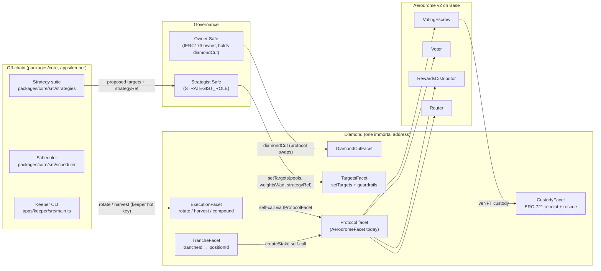
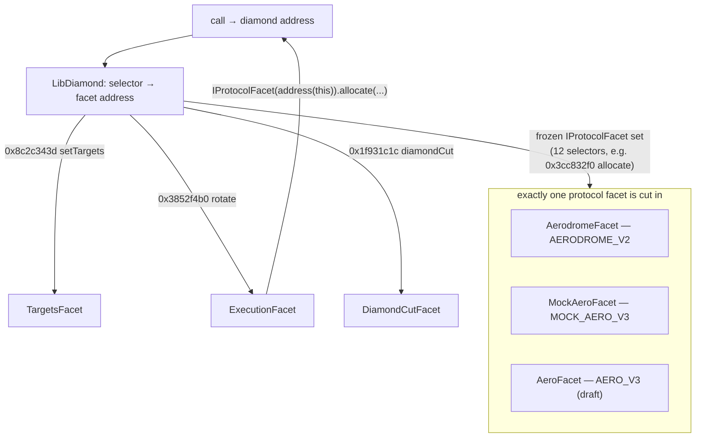
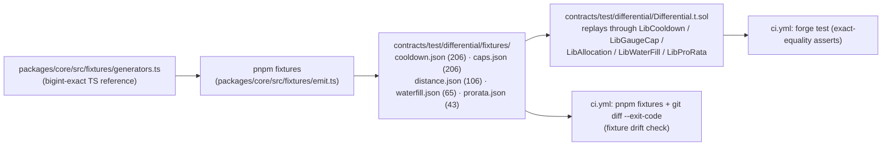

# Architecture

**Status:** M0–M2 complete (2026-07-17) · **Scope:** Base / Aerodrome v2 live, Aero (MetaDEX03) v3 simulated
**Spec provenance:** [PLAN.md](./PLAN.md) is the founding plan; this document describes what was actually built. Where they disagree, the code and this document win.

Aero Autopilot is a proof-of-concept relay: an EIP-2535 diamond custody vault on Base plus an
off-chain TypeScript strategy engine that manages veAERO voting/allocation positions. It runs live
against Aerodrome v2 today and is architected so that absorbing Aero's real v3 interfaces — code
drops from August 3, 2026, launch expected September — is a single `diamondCut`, not a custody
migration.

## 1. System overview



Decision-making is strictly off-chain (P1): the contracts expose a guardrailed target-allocation
interface and are strategy-blind — they cannot tell one strategy from another and never originate a
decision. The Strategist Safe queues a validated intent; the keeper mechanically converges tranches
toward it as cooldowns unlock; the Owner Safe holds the only catastrophic permission, `diamondCut`.

### Design principles (P1–P8, from PLAN.md §2)

| # | Principle |
|---|---|
| P1 | Strategy decisions are computed off-chain; validated, bounded, executed on-chain. |
| P2 | One deterministic core, two implementations (TS + Solidity), differential testing. TS generates, Solidity verifies. |
| P3 | Sub-weekly cadence is simulation-only until Aero ships; only the weekly strategy runs live on v2. |
| P4 | Diamond architecture: the custody address is forever, logic is facets; protocol swap = `diamondCut`. |
| P5 | Few, standard imports: OZ 5.x utilities, forge-std, vendored EIP-2535 reference. No stock OZ contracts that assume linear storage. |
| P6 | Single-owner custody, no share token. Owner Safe (cold, holds cut) / Strategist Safe (responsive, targets) / keeper (hot, mechanical). |
| P7 | Secrets never reach the browser; the site is fully static, datasets are CI-built JSON. |
| P8 | The v3 integration surface is quarantined in one facet behind the frozen `IProtocolFacet` selector set. |

## 2. The diamond

One EIP-2535 proxy (`contracts/src/Diamond.sol`, vendored reference, unmodified) whose functions are
provided by small, independently replaceable facets. The vendored trio —
`contracts/src/libraries/LibDiamond.sol`, `contracts/src/facets/DiamondCutFacet.sol`,
`contracts/src/facets/DiamondLoupeFacet.sol` — is the only sanctioned assembly outside the one-line
ERC-7201 slot bindings (P5).

### 2.1 Facets

| Facet | Source | External surface | Auth |
|---|---|---|---|
| DiamondCutFacet | `contracts/src/facets/DiamondCutFacet.sol` (vendored) | `diamondCut(cuts, init, calldata)` | Owner Safe only |
| DiamondLoupeFacet | `contracts/src/facets/DiamondLoupeFacet.sol` (vendored) | `facets()`, `facetFunctionSelectors()`, `facetAddresses()`, `facetAddress()`, `supportsInterface()` | view |
| OwnershipFacet | `contracts/src/facets/OwnershipFacet.sol` | `owner()`, `transferOwnership()` (IERC173) | Owner |
| AccessFacet | `contracts/src/facets/AccessFacet.sol` | `grantRole()`, `revokeRole()`, `hasRole()`, `STRATEGIST_ROLE()`, `KEEPER_ROLE()` | Owner grants/revokes |
| CustodyFacet | `contracts/src/facets/CustodyFacet.sol` | `onERC721Received()` (gated to the configured escrow), `rescueERC721()`, `rescueERC20()` | rescue: Owner |
| TrancheFacet | `contracts/src/facets/TrancheFacet.sol` | `createTranche()`, `setTrancheActive()`, `trancheCount()`, `getTranche()`, `trancheCooldownRemaining()` | create: keeper; active-flag: Owner |
| TargetsFacet | `contracts/src/facets/TargetsFacet.sol` | `setTargets()`, `currentTargets()`, `setGuardrails()`, `setPoolAllowlist()`, `setRewardTokenAllowlist()`, `setMinFlowOracle()`, `guardrails()`, `isPoolAllowed()`, `isRewardTokenAllowed()` | targets: strategist; config: Owner |
| ExecutionFacet | `contracts/src/facets/ExecutionFacet.sol` | `rotate()`, `harvest()`, `compound()` | keeper |
| AerodromeFacet | `contracts/src/facets/protocol/AerodromeFacet.sol` | the `IProtocolFacet` set (live v2) | self-call or Owner |
| MockAeroFacet | `contracts/src/facets/protocol/MockAeroFacet.sol` | `IProtocolFacet` + `mock_*` test hooks | self-call or Owner; hooks: Owner |
| AeroFacet | `contracts/src/facets/protocol/AeroFacet.sol` | `IProtocolFacet` (draft; mutating calls revert `NotLive`) | — |

`contracts/script/DiamondBuilder.sol` is the single source of cut composition: selector lists are
built symbolically (`X.f.selector`) so they cannot drift from the code, and the same builder is used
by `Deploy.s.sol`, `Cut.s.sol`, and every test fixture — the selectors that reach mainnet are the
selectors CI exercised.

`contracts/facets.json` is the off-chain mirror of the loupe: facet name → function signatures →
selectors → deployed address. It is regenerated with `pnpm manifest:build`
(`scripts/build-facet-manifest.mjs`, which runs `forge inspect <Facet> methodIdentifiers` for all 11
facets), checked in CI with `pnpm manifest:check`, and cross-checked against a freshly built
diamond's loupe by `contracts/test/diamond/LoupeManifest.t.sol`. The manifest script also fails on
selector collisions between facets that could coexist in one cut (the three protocol facets
deliberately share the `IProtocolFacet` selectors — they replace each other and never coexist).

### 2.2 Selector routing and the protocol seam



`ExecutionFacet` and `TrancheFacet` never import a concrete protocol: they self-call the diamond
through `contracts/src/interfaces/IProtocolFacet.sol`, so whichever protocol facet is currently cut
in serves the call. Swapping protocols is therefore a `Replace` cut on exactly the frozen selector
set (plus add/remove of the `mock_*` extras when `MockAeroFacet` is involved) — see
`DiamondBuilder.protocolSwapCuts()`.

`IProtocolFacet` — the frozen selector set every protocol facet implements (P8), 12 functions:

```solidity
protocolId() → bytes32                                  // "AERODROME_V2" | "MOCK_AERO_V3" | "AERO_V3"
createStake(amount, lockDuration) → positionId
allocate(positionId, pools[], weightsWad[])             // wholesale replace (v2 re-vote overwrites)
resetPosition(positionId)                               // exit/migration path
claimable(positionId, pools[]) → (tokens[], amounts[])
claimRewards(positionId, data) → aeroOut                // data = protocol-specific claim plumbing
claimRebase(positionId) → amount
swapToAero(data, minOut) → amountOut                    // data = protocol-specific routing
compoundPosition(positionId, amount)
positionWeight(positionId) → uint256
cooldownRemaining(positionId) → uint256
currentWindow() → (start, end)                          // v2: the weekly epoch; v3: (now, now)
```

### 2.3 Storage discipline (ERC-7201)

All state lives in `contracts/src/libraries/LibVaultStorage.sol` — one namespaced struct per domain,
each at the ERC-7201 slot `keccak256(abi.encode(uint256(keccak256(id)) - 1)) & ~bytes32(uint256(0xff))`:

| Namespace | Struct | Contents |
|---|---|---|
| `aero.autopilot.access` | `AccessStorage` | role → account → bool |
| `aero.autopilot.tranches` | `TrancheStorage` | `nextTrancheId`, trancheId → `{positionId, lastActionAt, active}` |
| `aero.autopilot.targets` | `TargetsStorage` | queued intent (`targetPools`, `targetWeightsWad`, `strategyRef`, `targetsUpdatedAt`), guardrails (`maxPoolWeightWad`, `maxDeltaWad`, `cooldownSec`, `minFlowOracle`), pool + reward-token allowlists |
| `aero.autopilot.protocol.config` | `ProtocolConfigStorage` | `protocolId`, `aero`, `votingEscrow`, `voter`, `rewardsDistributor`, `router` |
| `aero.autopilot.mockaero` | `MockAeroStorage` | mock v3 state: cooldown, κ, positions, pro-rata streams, emissions/burn bookkeeping |
| `aero.autopilot.init` | `InitStorage` | initId → executed (cut-init replay guard) |
| `aero.autopilot.reentrancy` | `ReentrancyStorage` | shared reentrancy status |

Rules (§4.2 of PLAN.md, enforced by `contracts/test/diamond/StorageNamespace.t.sol` where possible):
structs are append-only (deprecate via `__deprecated_*` renames); no facet declares contract-level
state; every namespace string is registered only in `LibVaultStorage.sol`; init contracts are the
only writers during cuts. The one-line `s.slot := slot` bindings are the only assembly outside the
vendored diamond internals — the same idiom OZ 5.x uses.

### 2.4 Access control

The Owner is not a role: it is the diamond owner via IERC173 (`OwnershipFacet`), held by the Owner
Safe. Roles live in `contracts/src/libraries/LibAccess.sol` — OZ AccessControl's logic reimplemented
over namespaced storage (stock OZ assumes linear layout and is not diamond-safe):

```
STRATEGIST_ROLE = keccak256("aero.autopilot.role.strategist")
                = 0x660da86c44f8f33c9116ba5717b918d5d06236ed44f3343d059725e0f992a419
KEEPER_ROLE     = keccak256("aero.autopilot.role.keeper")
                = 0xa80c4f7a35ec283afa52139b5d870f36e60e7950031433bca44f07d299ac1e03
```

Damage ceilings by construction (P6): keeper compromise costs liveness only (everything it can call
is mechanical and bounded); Strategist Safe compromise costs bad-but-bounded allocation inside the
guardrails until the Owner revokes; Owner Safe compromise costs everything — it holds `diamondCut` —
hence its higher threshold and coldest signers.

### 2.5 Targets, guardrails, and strategy identity

`TargetsFacet.setTargets(pools, weightsWad, strategyRef)` stores the strategist's allocation as a
queued intent after validating, in order: pool allowlist (`PoolNotAllowed`), per-pool cap
(`WeightExceedsMax` vs `maxPoolWeightWad`), duplicates (`DuplicatePool`), exact WAD sum
(`WeightsMustSumToWad`), max reallocation delta (`DeltaExceedsMax` — half-L1 distance between old
and new targets over the union of pools, computed by `LibAllocation.distanceWad`, differentially
tested), and an optional min-organic-flow oracle hook
(`contracts/src/interfaces/IMinFlowOracle.sol`, stubbed — `OracleRejectedTargets` on refusal).

Per P1 the contracts are strategy-blind. Exactly two traces of strategy identity touch the chain:

1. the Owner-set cooldown guardrail (`setGuardrails(maxPoolWeightWad, maxDeltaWad, cooldownSec)`) —
   operationally, changing `cooldownSec` is what "switching strategy class" means on-chain (7d for
   the v2 grid; 48h/24h/1h for v3 modes);
2. the opaque `bytes32 strategyRef`, emitted in `TargetsQueued` but never validated — keccak256 of
   the canonical strategy-config JSON (`strategyRef()` in `packages/core/src/strategies/base.ts`),
   an attribution tag linking every target to the config that produced it. Attribution, not
   enforcement.

### 2.6 Execution path

`ExecutionFacet` (keeper-gated, `nonReentrant` via the shared namespace):

- `rotate(trancheId)` — enforces the vault cooldown (`TrancheCoolingDown`), then self-calls
  `allocate(positionId, targetPools, targetWeightsWad)`. The vault can be stricter than the
  protocol, never looser. Allocate replaces the previous allocation wholesale in every protocol
  facet — an explicit reset first would burn v2's one-action-per-epoch.
- `harvest(trancheId, claimData)` — self-calls `claimRewards` then `claimRebase`. For v2,
  `claimData` is `abi.encode(pools[], feeTokens[][], bribeTokens[][])`; the facet re-derives the
  reward contracts from the Voter itself and checks the pool allowlist, so a hostile keeper cannot
  point the Voter at arbitrary code.
- `compound(trancheId, swapData, minOut)` — self-calls `swapToAero` then `compoundPosition`: the
  batched CLAIM → SWAP → ADD → STAKE flow the v3 MetaRouter spec anticipates for relay compounding.
  For v2, `swapData` is `abi.encode(IRouter.Route[][], uint256[] amountsIn)`; every hop must stay
  inside the Owner-set reward-token allowlist and every route must terminate in AERO
  (`RouteMustEndInAero`) — a compromised keeper can waste gas, not exfiltrate value. Slippage is
  enforced in aggregate across routes via `minOut`.

`TrancheFacet.createTranche(amount, lockDuration)` stakes AERO held by the diamond into a fresh
position via the protocol facet and registers it. Positions are created as separate stakes from the
start: v3 positions cannot be split, so the staggered-cooldown tranche structure must exist at stake
time — the same discipline is applied to v2.

### 2.7 Protocol facets

**AerodromeFacet** (live v2, Base). Honors v2 mechanics: `Voter.vote()` overwrites the previous
vote, one vote action per epoch per tokenId; votes persist across epochs but decay with ve balance;
rebase claims via `RewardsDistributor.claim()` deposit straight back into the lock.
`cooldownRemaining()` computes the epoch window locally (fixed in v2) — the vote window is
`epoch start + 1h … epoch end − 1h`, verified empirically by the fork suite (the final hour of the
epoch and the first hour after the flip are closed). External interfaces are the minimal set in
`contracts/src/interfaces/external/IAerodrome.sol` (`IVotingEscrow`, `IVoter`,
`IRewardsDistributor`, `IRouter`, `IVotingReward`). Mutating entry points use `onlyAuthorized`:
self-call from the diamond's execution facets, or direct Owner call (the migration runbook path).

Aerodrome v2 addresses on Base, cross-verified on-chain (`escrow.token() == AERO`,
`voter.ve() == escrow`, `rewardsDistributor.ve() == escrow`, `router.voter() == voter`):

| Contract | Address |
|---|---|
| AERO | `0x940181a94A35A4569E4529A3CDfB74e38FD98631` |
| VotingEscrow | `0xeBf418Fe2512e7E6bd9b87a8F0f294aCDC67e6B4` |
| Voter | `0x16613524e02ad97eDfeF371bC883F2F5d6C480A5` |
| RewardsDistributor | `0x227f65131A261548b057215bB1D5Ab2997964C7d` |
| Router | `0xcF77a3Ba9A5CA399B7c97c74d54e5b1Beb874E43` |

**MockAeroFacet** (test-only v3 semantics, parameterized from the `dromos-labs/metadex-specs` idea
drafts): per-position rolling cooldown, per-second streaming revenue pro-rata by weight
(`LibProRata`, a Synthetix-style accumulator), gauge caps `emissions ≤ κ × trailingRevenue` with
overage burned (`LibGaugeCap.apply_`). Every parameter is Owner-settable via `mock_*` hooks
(`mock_setCooldown`, `mock_setKappa`, `mock_setRevenueRate`, `mock_setEmissionRate`,
`mock_checkpointEmissions`, plus view hooks). Balances are bookkeeping, no token transfers — the
mock exists so vault flows and invariants can be exercised against v3 semantics before v3 exists.

**AeroFacet** (v3 draft). Idea-draft placeholder carrying a spec-diff log in its NatSpec; every
mutating entry point reverts `NotLive()` so a premature cut cannot move funds. Expected to be
written twice (P8): drafted against the specs (done), rewritten against published code (M5).

### 2.8 Init contracts

- `contracts/src/init/DiamondInit.sol` — genesis init: registers ERC-165 interfaces (including
  ERC-721 receipt), writes protocol config, grants strategist/keeper, sets guardrails and
  allowlists. Guarded by a unique `initId` (`AlreadyInitialized` on replay); the deploy script uses
  `keccak256(abi.encodePacked("genesis", block.chainid))`.
- `contracts/src/init/ProtocolSwapInit.sol` — runs inside every protocol-swap cut: updates
  `protocolId`, optionally the external addresses (zero = keep current) and the incoming protocol
  cooldown, atomically with the selector replace. Custody, tranches, targets, and roles are
  untouched — the CI upgrade test asserts exactly that.

## 3. The off-chain twin (`packages/core`)

The deterministic core exists twice — TypeScript and Solidity — and the differential suite proves
they agree bit-for-bit (P2). All fixture-relevant math is 1e18 bigint fixed-point with Solidity
semantics (floor division, uint256 range checks, OZ `mulDiv` 512-bit intermediates); floats appear
in analytics/plotting only.

| TS module | Solidity twin | Logic |
|---|---|---|
| `packages/core/src/math/fixed.ts` | `contracts/src/libraries/LibFixedPoint.sol` | wad mul/div, `mulDiv`, `saturatingSub` |
| `packages/core/src/scheduler/cooldown.ts` | `contracts/src/libraries/LibCooldown.sol` | `cooldownRemaining` / `canAct` |
| `packages/core/src/scheduler/scheduler.ts` (`allocationDistanceWad`) | `contracts/src/libraries/LibAllocation.sol` | half-L1 allocation distance (delta guardrail) |
| `packages/core/src/model/prorata.ts` | `contracts/src/libraries/LibProRata.sol` | streaming pro-rata accumulator |
| `packages/core/src/model/gaugecap.ts` | `contracts/src/libraries/LibGaugeCap.sol` | cap/burn arithmetic |
| `packages/core/src/strategies/waterfill.ts` | `contracts/src/libraries/LibWaterFill.sol` | chunked-greedy water-filling (ε-approximate, deterministic, inputs bounded ≤ 1e36) |

Other modules:

- **`model/`** — two protocol models behind one `ProtocolModel` interface
  (`packages/core/src/model/types.ts`): `EpochModel` (`model/epoch.ts`, v2: weekly flips, one vote
  change per epoch, persistent votes, lump-sum pro-rata rewards at epoch end) and `ContinuousModel`
  (`model/continuous.ts`, v3: per-second streaming, per-position cooldown, gauge caps with burn,
  crowd models: static / reactive-with-lag / adversarial wash-bait). `model/scenarios.ts` ships the
  preset story scenarios (`earlyAllocatorScenario`, `latencyRaceScenario`, wash-bait, mixed market)
  with deterministic seeds (`model/prng.ts`) so a `{scenario, seed}` pair reproduces a run exactly.
- **`strategies/`** — the plan §6 suite behind
  `Strategy { propose(state, portfolio): TargetAllocation }`: `FixedGrid` (weekly = the only
  live-runnable strategy on v2; 48h/24h/1h grids sim-only), `PersistenceCarry`
  (volatility-haircut trailing revenue, (s,S)-threshold moves), `WaterFilling`, and
  `ContinuousGreedy` (down to one Base block ≈ 2s, deliberately, to demonstrate the latency-race
  limit). `strategies/index.ts` is the registry (`createStrategy(config)`,
  `STRATEGY_DESCRIPTORS` with schema-driven config forms); `strategies/base.ts` provides
  `canonicalJson`/`strategyRef` and exact-WAD normalization.
- **`backtest/`** — `runner.ts` drives a strategy against either model through the shared
  scheduler; metrics: total/benchmark/excess return, max drawdown vs benchmark, turnover,
  on-target-%, and `emissionsAccuracy` (emitted ÷ (emitted + burned)) — the calibration check
  against Aero's published 48%→70% emissions-accuracy methodology. `worker.ts` exposes
  `executeRequest` for the web worker. Golden backtest snapshots live in
  `packages/core/test/golden/` and are asserted in CI so refactors that change results fail loudly.
- **`data/`** — `indexer.ts` + `cli.ts` (viem indexer for per-epoch, per-pool weights, voter revenue
  and emissions of the top-N Aerodrome pools; `pnpm --filter @aero-poc/core index-data`),
  `calibrate.ts` (raw → AERO-denominated `EpochDataset` via a static price table — documented PoC
  approximation), `synthetic.ts` (calibrated synthetic epoch datasets). A committed sample lives at
  `data/aerodrome-sample.json`.
- **`fixtures/`** — `generators.ts` + `emit.ts` emit the differential vectors (below).

## 4. The differential-testing pipeline (P2)



TS generates, Solidity verifies: 626 committed vectors, replayed with exact-equality assertions.
CI regenerates the fixtures and fails on any diff, so neither implementation can silently drift.
`packages/core` approaches the same logic from the other side with vitest + fast-check property
tests (`packages/core/test/`).

## 5. Test suite

Pinned toolchain: solc 0.8.26, optimizer 200 runs, `via_ir = false`, EVM cancun
(`contracts/foundry.toml` — frozen for Basescan verification). 65 non-fork forge tests + 7 fork
tests; 47 vitest tests in `packages/core` (plus the keeper's ABI-drift test in
`apps/keeper/test/abi.test.ts`).

| Suite | Location | What it proves |
|---|---|---|
| Unit | `contracts/test/unit/` | every facet function and guardrail branch against `MockAeroFacet` (`VaultFixture.sol` fixture) |
| Diamond | `contracts/test/diamond/` | `CutAuth.t.sol` (only the owner cuts — fuzzed callers, strategist and keeper revert); `LoupeManifest.t.sol` (loupe ↔ `facets.json`, no orphan selectors); `StorageNamespace.t.sol` (exact ERC-7201 slots, all distinct, no collision with `LibDiamond`'s slot); `Upgrade.t.sol` (populate full state → protocol swap → every namespace byte-identical, all flows functional — the September migration rehearsal in miniature, run on every CI build) |
| Invariant | `contracts/test/invariant/VaultInvariants.t.sol` | under random keeper/strategist/time sequences: `invariant_cooldownNeverViolated`, `invariant_streamWeightsBoundedByPower`, `invariant_emissionsConservation` (streamed + burned = emitted), `invariant_selectorRoutingImmutable` (no sequence excluding `diamondCut` alters routing), `invariant_storedTargetsRespectGuardrails` |
| Differential | `contracts/test/differential/` | §4 above |
| Fork | `contracts/test/fork/AerodromeFork.t.sol` | see below |

**Fork suite** (7/7 green on 2026-07-17 at pinned block 48,750,000; needs `BASE_RPC_URL`, runs via
`forge test --match-path 'test/fork/*'`; default CI excludes it): the full money path against real
Aerodrome through the diamond — create lock → vote → epoch flip → claim real fees/bribes → compound
via the real escrow → re-vote (`test_fork_moneyPathEndToEnd`); empirical vote-window boundaries
(`test_fork_voteWindowBoundary`: closed in the final 1h of the epoch and the first 1h after the
flip); same-epoch re-vote reverting at the protocol level (`test_fork_sameEpochRevoteRevertsAtProtocol`);
zero-reward claim safety; a real WETH→AERO swap through the Router with route validation
(`test_fork_swapToAeroThroughRouter`); custody transfer out and back in
(`test_fork_custodyTransferInOut`); and an Aerodrome→Mock→Aerodrome facet swap mid-lifecycle proving
custody and tranche state survive a live protocol transition (`test_fork_facetSwapMidLifecycle`).
Pools are discovered on-fork rather than hardcoded.

## 6. The keeper (`apps/keeper`)

A thin CLI (`apps/keeper/src/main.ts`, run as `pnpm --filter @aero-poc/keeper keeper -- <command>`):
`status | rotate | harvest | compute-targets | watch`. Dry-run by default; `--execute` (with
`KEEPER_PRIVATE_KEY`) simulates then sends. Env: `BASE_RPC_URL`, `BASE_RPC_URL_FALLBACK`,
`KEEPER_PRIVATE_KEY`, `DIAMOND_ADDRESS` (plus `AERODROME_VOTER` override for testnets/forks).

The keeper deliberately cannot submit targets — `compute-targets --config strategy.json` prints the
`strategyRef` and the Safe payload guidance for the Strategist Safe instead of sending anything
(P6). `status --config strategy.json` compares the on-chain `strategyRef` against the approved
config and warns loudly on mismatch — the alert that catches a strategist running the wrong config,
otherwise invisible precisely because the contracts are strategy-blind. `harvest` reconstructs the
v2 claim plumbing from the chain (`buildClaimData`), mirroring what `AerodromeFacet` validates.
`watch --interval 600` loops status → rotate → harvest.

The merged ABI it drives lives in `apps/keeper/src/abi.ts` as human-readable signatures, greppable
against `facets.json` (asserted by `apps/keeper/test/abi.test.ts`).

## 7. The two protocol transitions

```mermaid
sequenceDiagram
    participant OS as Owner Safe
    participant D as Diamond
    participant A2 as AerodromeFacet (v2)
    participant V3 as AeroFacet (v3)

    Note over D: today — AERODROME_V2 live,<br/>MOCK_AERO_V3 in tests
    Note over V3: Aug 3+ — spec/code drops land;<br/>AeroFacet rewritten behind the frozen<br/>IProtocolFacet set (P8), fork-tested
    OS->>D: Sepolia rehearsal cut (Cut.s.sol run())
    Note over OS: September launch week
    OS->>D: exit positions (rescueERC721 per runbook)
    OS->>D: diamondCut(protocolSwapCuts(AeroFacet), ProtocolSwapInit, args)
    D-->>A2: v2 selectors replaced
    D->>V3: IProtocolFacet routes to AeroFacet
    OS->>D: migrate + re-stake fresh tranches
    Note over D: custody address, tranches, targets,<br/>roles: unchanged
```

Both transitions (August: absorb published code into `AeroFacet`; September: cut it live) are a
single `diamondCut` built by `DiamondBuilder.protocolSwapCuts()` with `ProtocolSwapInit` executing
atomically. The ceremony, rehearsals, and the position-exit choreography around the September event
are specified step-by-step in [OPERATIONS.md](./OPERATIONS.md) §4–§5. What the diamond buys here:
one immortal custody address through two hard transitions on a fixed external timeline. What it
costs: delegatecall/shared-storage risk (contained by §2.3), selector-collision management
(CI-checked), harder explorer UX (OPERATIONS.md §6), and cut power as a single point of
catastrophic failure (contained by the Owner Safe threshold and the cut runbook). The documented
immutability endgame — a cut removing `diamondCut` itself — remains a v1+ decision.

## 8. CI surface (`.github/workflows/`)

| Workflow | Trigger | Contents |
|---|---|---|
| `ci.yml` | push to `main`, PRs | core + keeper typecheck and vitest; fixture drift check (`pnpm fixtures` + `git diff --exit-code`); `forge fmt --check`; `forge build --deny-warnings`; `FOUNDRY_PROFILE=ci forge test --no-match-path 'test/fork/*'` (unit/diamond/invariant/differential; CI profile: 1024 fuzz runs, 256×64 invariant runs); `pnpm manifest:check`; web build + bundle secret scan |
| `fork-tests.yml` | nightly + PRs labeled `fork-tests` | the fork suite with the `BASE_RPC_URL` repository secret |
| `data.yml` | weekly schedule | indexer run (`index-data`) committing versioned JSON into `data/` |
| `pages.yml` | push to `main` | build `apps/web`, secret-scan the bundle (`scripts/scan-bundle-for-secrets.mjs` — fails on key-shaped strings or forbidden env names in `dist/`), deploy to GitHub Pages |

Secrets (`BASE_RPC_URL`, `ETHERSCAN_API_KEY`, `KEEPER_PRIVATE_KEY`) exist only in Actions secrets,
fork-test config, and the keeper environment — never in `apps/web` (P7). `.env.example` documents
every variable.
